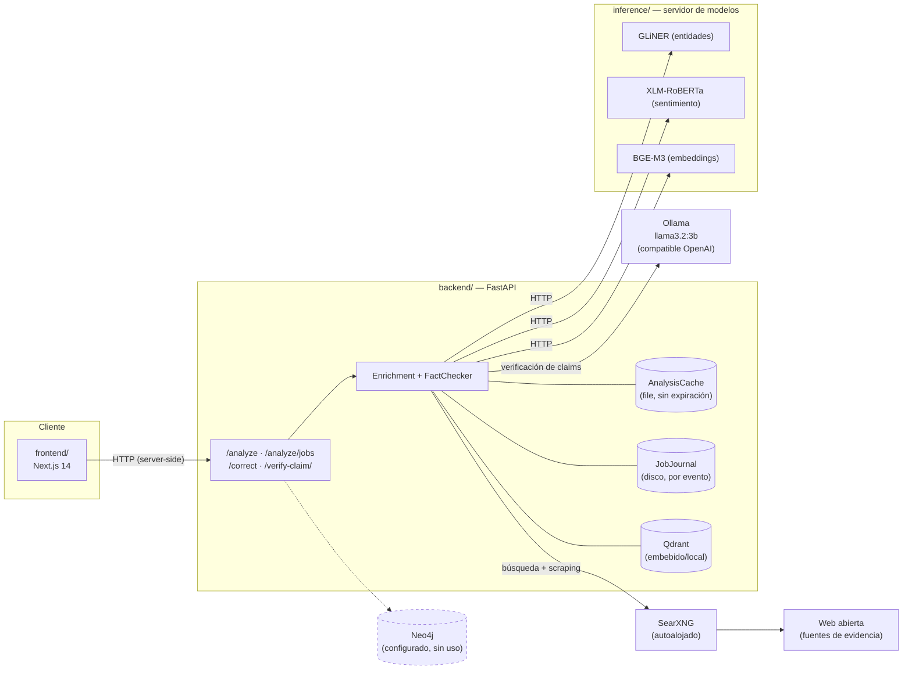
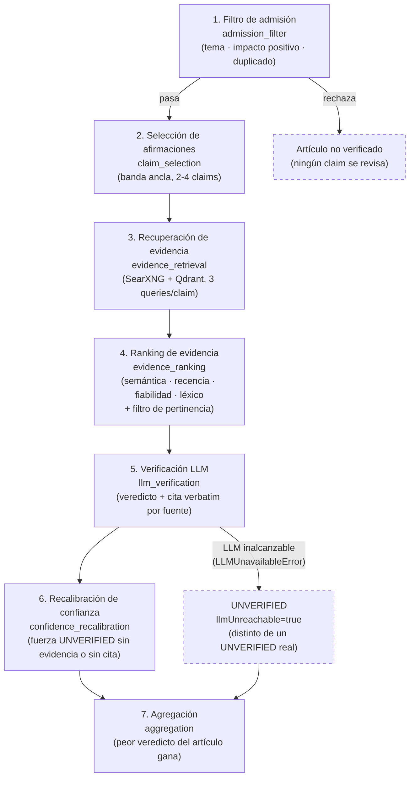

# Documento de Arquitectura Técnica

## Sistema Integral de Inteligencia de Noticias: Pipeline, Verificación y Sistema de Recomendación

Versión 1.0 — Septiembre de 2026

---

## Índice

1. Alcance del Documento
2. Fase 1: Pipeline de Extracción, Enriquecimiento y Verificación
3. Fase 2: Ecosistema de Grafos y Sistema de Recomendación
4. Fase 3: Integración Técnica de la Aplicación Móvil
5. Conclusión Técnica
6. Referencias

---

## 1. Alcance del Documento

Este documento describe exclusivamente la arquitectura técnica y la estrategia lógica del sistema: qué componentes existen, con qué tecnología están construidos y por qué cada decisión de diseño es la que es. No cubre la justificación de negocio ni la propuesta de valor del producto — para eso, véase `idea-de-negocio.md`. Para una síntesis breve orientada a toma de decisiones, véase `resumen-ejecutivo.md`.

El sistema se organiza en tres fases técnicas. La Fase 1 es el pipeline ya construido que extrae, enriquece y verifica noticias. La Fase 2 es el sistema de recomendación basado en grafos, en diseño. La Fase 3 es la capa cliente que consume ambas. El proyecto reside en un monorepo que separa backend, frontend e infraestructura de contenedores.

---

## 2. Fase 1: Pipeline de Extracción, Enriquecimiento y Verificación

### 2.1. Arquitectura y Orquestación

El backend está construido sobre Python y FastAPI, con `uv` como gestor de dependencias. El entorno completo se levanta mediante contenedores orquestados por `docker-compose`, que coordina la base de datos de grafos (Neo4j, configurada pero sin uso todavía), el motor de búsqueda autoalojado (SearXNG), un servicio de inferencia propio que aloja los modelos de entidades, sentimiento y embeddings, y la API del backend. Las peticiones de análisis se manejan de forma asíncrona mediante un sistema de trabajos en segundo plano con sondeo de progreso (polling) y una caché local de resultados por URL (que distingue además los umbrales con que se ejecutó cada análisis), de modo que una noticia ya analizada no vuelve a pagar el costo completo del pipeline salvo que se solicite explícitamente su reprocesamiento. Cada paso de cada ejecución se guarda además, según ocurre, en un diario en disco: una ejecución que falla a mitad conserva todo lo que llevaba hecho y sigue siendo consultable tras un reinicio.

| Componente | Tecnología |
|---|---|
| API y orquestación | Python, FastAPI, `uv` |
| Contenerización | Docker, `docker-compose` |
| Servicio de inferencia (entidades, sentimiento, embeddings) | Servicio FastAPI independiente que carga los modelos GLiNER, XLM-RoBERTa y BGE-M3; el backend lo consulta por HTTP |
| Base de datos de grafos (prevista para Fase 2; hoy sin uso) | Neo4j |
| Motor de búsqueda para evidencia | SearXNG autoalojado |
| Modelo de lenguaje | Endpoint compatible con OpenAI, por defecto `llama3.2:3b` local vía Ollama |
| Base de datos vectorial | Qdrant (modo embebido/local) |

*El backend nunca importa `torch`/`transformers`/`gliner`; todo lo que necesita de esos modelos llega por HTTP desde `inference/`. Neo4j (línea punteada) está configurado — su contraseña se exige al arrancar — pero nada lo lee ni lo escribe todavía (Fase 3 del roadmap).*

### 2.2. Módulo de Scraping y Descubrimiento

El sistema de recolección de noticias combina dos responsabilidades separadas:

- **Descubrimiento de URLs**: existe una estrategia basada en fuentes RSS estructuradas (una definición YAML por medio, 12 en total) pensada para rastrear contenido nuevo por fuente y por tema. **A la fecha de este documento no está conectada al pipeline**: nada la invoca, y la única vía por la que una noticia entra al sistema es que una persona envíe su URL al análisis. La ingesta automática es trabajo pendiente (véase `docs/roadmap.md`).
- **Extracción de contenido**: el texto principal de cada artículo se obtiene mediante un motor de extracción especializado en limpiar el ruido de una página web (navegación, publicidad, pies de página) y quedarse únicamente con el cuerpo editorial.
- **Sitios de alta complejidad (JavaScript)**: el pipeline contempla estrategias adicionales (renderizado de DOM) para medios que requieren ejecución de JavaScript para mostrar su contenido. A la fecha de este documento estas estrategias existen como puntos de extensión declarados en la arquitectura, pero no están implementadas de forma funcional — no deben asumirse como operativas.

### 2.3. Motor NLP y Enriquecimiento

Cada artículo extraído pasa por una pila de procesamiento de lenguaje natural que lo transforma de texto plano a una estructura de datos enriquecida:

- **Extracción de entidades y palabras clave**: identifica personas, organizaciones, lugares y otros términos relevantes dentro del texto.
- **Extracción de afirmaciones (claims)**: descompone el artículo en oraciones candidatas a ser hechos verificables, mediante un puntaje heurístico (ver §2.4.2).
- **Clasificación temática**: compara el artículo contra un conjunto de temas predefinidos en el espacio vectorial de embeddings, normalizando las similitudes por encima de un umbral con una función softmax para obtener una distribución de probabilidad sobre temas.
- **Análisis de sentimiento**: evalúa la carga emocional del texto (positiva, negativa, neutra).
- **Análisis de calidad editorial**: calcula métricas como legibilidad, objetividad, constructividad, esperanza (hopefulness), impacto social y valor inspiracional, combinando conteo léxico sobre vocabularios curados con métricas estándar de legibilidad de texto.
- **Embeddings vectoriales**: todo el contenido se vectoriza mediante un modelo de la familia `sentence-transformers` (BGE-M3, servido por el servicio de inferencia), siendo esta representación la base de casi todas las comparaciones de similitud del resto del sistema (deduplicación, recuperación de evidencia, clasificación temática, y en el futuro, recomendación).

### 2.4. Estrategia de Verificación de Hechos (Fact-Checking)

Esta es la etapa más crítica del sistema y se describe en dos niveles a la vez: qué componente tecnológico ejecuta cada paso, y qué lógica de decisión justifica su diseño. El fact-checking no se resuelve en un único paso de "verdadero o falso": es una cadena de filtros sucesivos, cada uno más costoso que el anterior, donde cualquier capa puede rechazar o degradar el resultado, pero ninguna capa posterior puede compensar una señal fuerte de rechazo emitida por una capa previa. El principio rector es *fail-closed*: ante la duda, el sistema se inclina hacia "no verificado" antes que hacia una afirmación confiada que resulte errónea, porque el costo de una falsa sensación de certeza es mayor que el costo de ser conservador.

#### 2.4.1. Filtro de admisión

Antes de gastar recursos verificando afirmaciones, el artículo debe superar una puerta de admisión con tres criterios independientes y obligatorios, implementados como validadores dedicados:

- **Relevancia temática**: el artículo debe alcanzar una confianza mínima en al menos un tema del clasificador descrito en §2.3. No se exige que un tema domine sobre los demás — basta con superar un umbral absoluto — porque un artículo puede tocar legítimamente varios temas a la vez.
- **Impacto positivo**: se calcula una puntuación compuesta ponderada (constructividad, valor inspiracional, esperanza, sentimiento positivo, objetividad, impacto social) que funciona como una nota promedio, normalizada a la escala 0–1. Ese promedio puede complementarse con pisos duros que descalifican el artículo aunque el promedio sea alto, porque un promedio puede ocultar un defecto grave puntual. Hoy existen dos: objetividad mínima y tope de sentimiento negativo. Se activan o desactivan con una única opción, por ejecución o por defecto (`positive_impact_hard_fail_enabled` / `POSITIVE_IMPACT_HARD_FAIL_ENABLED`); en la configuración actual del repositorio vienen **desactivados por defecto**, de modo que solo restan puntuación y quedan anotados como motivo. Los pisos de constructividad y de valor inspiracional se desactivaron deliberadamente porque rechazaban demasiados artículos reales: hoy solo restan puntuación y quedan anotados como motivo.
- **No-duplicidad**: se compara el embedding del artículo contra el de su vecino más similar ya indexado en la base de datos vectorial, usando distancia coseno. En vez de un simple sí/no, se define un espacio de tres bandas: por debajo de un umbral de relación, el artículo se considera *no relacionado*; entre ese umbral y un umbral de duplicidad, se considera *relacionado* (señal de contexto útil, no descalifica); por encima del umbral de duplicidad, se rechaza como *duplicado*. Un artículo almacenado con la **misma URL** nunca cuenta como duplicado del que se está analizando: es el mismo artículo, y así un reanálisis no se rechaza a sí mismo. Esta banda intermedia importa: tratar "relacionado" como "duplicado" perdería cobertura legítima de un mismo evento cubierto por varias fuentes, mientras que ignorarla del todo desperdiciaría una señal de contexto que la Fase 2 puede reutilizar directamente como arista de similitud entre noticias (véase §3.2).

Si cualquiera de los tres criterios falla, el pipeline se detiene ahí: no se extraen afirmaciones, no se busca evidencia y no se invoca ningún modelo de lenguaje. Es, a propósito, la capa más barata y la primera en aplicarse.

#### 2.4.2. Selección de afirmaciones verificables

No todas las oraciones de un artículo son hechos comprobables. Cada oración se puntúa por la presencia de señales objetivas de verificabilidad — entidades nombradas, cifras, fechas, unidades de medida, verbos que reportan un hecho de terceros ("anunció", "confirmó", "reveló"), citas textuales, longitud mínima — y se descarta si no alcanza un umbral mínimo. Es importante notar qué no mide este puntaje: no mide si la afirmación es importante o interesante, sino si tiene la forma estructural de un hecho verificable; una oración puramente opinativa, por bien escrita que esté, no genera trabajo de verificación innecesario.

Sobre las afirmaciones que superan ese umbral se aplican dos controles de costo, apoyados en el mismo espacio de embeddings usado en el resto del pipeline:

- **Deduplicación semántica**: si dos afirmaciones seleccionadas son, en esencia, el mismo hecho parafraseado dos veces, solo una sobrevive.
- **Banda de afirmaciones ancla**: las afirmaciones se priorizan por cuán determinantes son para la tesis del artículo (centralidad respecto al titular y la entrada, solapamiento con sus sujetos principales, especificidad) y se conserva una banda configurable (por defecto de 2 a 4). El tope evita que un artículo inusualmente denso en hechos dispare un costo de verificación desproporcionado; si el artículo aporta menos afirmaciones que el mínimo, el informe lo señala en lugar de ocultarlo. Las oraciones que se leen como opinión o interpretación se descartan antes: no hay evidencia que pueda confirmar o refutar "un paso esperanzador para el sector".

#### 2.4.3. Recuperación de evidencia: un embudo de dos etapas

Buscar evidencia y, sobre todo, extraer el contenido completo de cada fuente candidata es la operación más costosa de todo el pipeline. Por eso la recuperación está diseñada como un embudo: primero se reúnen candidatos baratos (título y fragmento breve) desde dos fuentes — el motor de búsqueda autoalojado (SearXNG) para evidencia externa, con dos consultas construidas a partir de las entidades, cifras y fechas de la afirmación (una afirmativa y otra que busca refutaciones), y una búsqueda vectorial contra el repositorio interno de artículos ya procesados (Qdrant) para evidencia histórica propia, excluyendo siempre el propio artículo. Hoy estas operaciones se ejecutan una tras otra, no en paralelo, y las afirmaciones se verifican secuencialmente: es el principal cuello de botella conocido (aún no medido). Sobre ese conjunto combinado se aplica un preordenamiento barato por similitud semántica superficial; solo los candidatos web que sobreviven ese preordenamiento y entran dentro de un tope fijo pasan a la etapa cara de extracción completa de contenido, reutilizando el mismo extractor descrito en §2.2. Los candidatos internos, al ya tener contenido completo indexado, se reincorporan sin ese costo adicional. La lógica general es filtrar barato y enriquecer caro únicamente sobre lo que ya prometía ser relevante; invertir el orden multiplicaría el costo por el número de candidatos descartados sin ninguna ganancia de calidad.

#### 2.4.4. Ranking de evidencia

La evidencia reunida se reordena mediante un puntaje que combina tres señales independientes, cada una con su propio peso configurable:

- **Afinidad semántica** con la afirmación, calculada sobre los mismos embeddings de todo el sistema.
- **Recencia**, con decaimiento exponencial según una vida media configurable: la evidencia antigua no se descarta de golpe, pero pierde peso de forma suave a medida que envejece.
- **Fiabilidad de la fuente**, mediante un índice por dominio cargado desde el repositorio de fuentes, con un valor neutral por defecto cuando el dominio es desconocido. Ese valor por defecto no es una calificación, y el sistema lo marca como tal para que no se presente igual que la fiabilidad real de un medio calificado.

Ningún factor domina por diseño: una fuente muy afín pero obsoleta, o muy reciente pero poco fiable, no desplaza automáticamente a una evidencia mejor equilibrada. Solo se retiene un número acotado de las mejores evidencias por afirmación.

#### 2.4.5. Verificación mediante modelo de lenguaje

El paso que involucra un modelo de lenguaje (servido localmente por defecto, con la posibilidad de apuntar a un proveedor externo mediante configuración) está deliberadamente acotado: se exige una salida estructurada con un veredicto de un conjunto cerrado de cinco categorías (verdadero, parcialmente verdadero, falso, engañoso, no verificado), una confianza numérica, una explicación breve, los índices de qué evidencias concretas se usaron para decidir y, por cada fuente, su postura (apoya, contradice, no guarda relación) con la cita textual en la que se basó. Toda cita que no aparezca literalmente en la fuente se descarta: una cita inventada es peor que ninguna. Se instruye explícitamente al modelo a responder "no verificado" cuando la evidencia esté vacía o no guarde relación con la afirmación, y a nunca afirmar algo que la evidencia no respalde. Reducir la tarea a una clasificación cerrada con justificación citada — en vez de un veredicto libre sin trazabilidad — convierte la pregunta de si el modelo alucinó en algo verificable mecánicamente en el paso siguiente, en vez de una cuestión de confianza ciega en el modelo.

#### 2.4.6. Recalibración de confianza

Esta es la salvaguarda más importante del sistema, y la razón por la que puede usarse un modelo de lenguaje modesto sin comprometer la fiabilidad general del resultado:

- Si la cantidad de evidencia disponible no alcanza un mínimo, el veredicto se fuerza a "no verificado" con confianza cero, antes incluso de mirar lo que dijo el modelo.
- La confianza final no es la que reporta el modelo tal cual: se combina con una puntuación de calidad de evidencia calculada de forma independiente (afinidad promedio de la evidencia retenida, proporción de evidencia efectivamente citada sobre el total disponible, y cantidad de evidencia respecto al máximo esperado).
- Un veredicto definitivo (verdadero, falso o engañoso) que no cita ninguna evidencia, aunque hubiera evidencia disponible, se degrada automáticamente a "no verificado" con un techo de confianza bajo. Una afirmación categórica sin ninguna referencia comprobable es, por definición, no fundamentada, sin importar cuán convincente sea el texto de la explicación.
- Un veredicto "verdadero" cuando alguna fuente contradice un detalle se degrada a "parcialmente verdadero", y si lo respalda un solo dominio independiente su confianza queda acotada.

La regla de las citas es agnóstica al modelo utilizado: protege contra la alucinación de cualquier modelo, presente o futuro, sin necesitar reentrenamiento ni ajustes de prompt adicionales.

#### 2.4.7. Agregación a nivel de artículo

Un artículo puede contener varias afirmaciones verificadas por separado. El veredicto global del artículo no es un promedio ni el veredicto de la afirmación más relevante: es el peor veredicto de todo el conjunto, según un orden de severidad fijo (verdadero < parcialmente verdadero < no verificado < engañoso < falso); la confianza global sí se promedia, pero el veredicto no. Limitación conocida: como "no verificado" pesa más que "verdadero", una sola afirmación sin evidencia suficiente —el resultado habitual con un modelo local pequeño— domina el veredicto del artículo, y el promedio de confianzas mezcla veredictos distintos. Separar "cuánto se pudo comprobar" de "qué se encontró" está pendiente.

#### 2.4.8. Diagrama de las siete etapas

*Cada afirmación queda etiquetada con `reached_stage`: la etapa más lejana a la que llegó antes de que algo la detuviera o la degradara. Un fallo de admisión detiene el artículo entero antes de la etapa 2; un LLM inalcanzable (endpoint caído, tras agotar reintentos) se distingue de un veredicto `UNVERIFIED` genuino mediante `llm_unreachable`, para que un backlog de errores de infraestructura no se lea igual que un backlog de afirmaciones sin respaldo.*

#### 2.4.9. Síntesis de la estrategia

Cada capa de esta cadena es más barata y más determinista que la siguiente, y cada capa puede decir "no" de forma definitiva; ninguna capa posterior puede revertir el rechazo de una capa anterior. El único punto donde interviene un modelo de lenguaje está acotado a una clasificación cerrada, forzada a citar sus fuentes, y su salida pasa por una recalibración de confianza que no depende de la introspección del propio modelo. El resultado es un sistema cuya fiabilidad no descansa en la fiabilidad de un único componente de inteligencia artificial, sino en la composición de varias capas independientes de control.

### 2.5. Frontend y Corrector de Textos

El ecosistema se cierra con un frontend en Next.js 14 que consulta la API del backend mediante un patrón de trabajos en segundo plano con sondeo periódico del progreso, expuesto como una línea de tiempo de fases (obtención, enriquecimiento, validación, verificación, almacenamiento, resultado). Una pantalla adicional, "Live", permite seguir desde otro cliente cualquier verificación en curso: las consultas enviadas al buscador, cada fuente encontrada y los motores que la devolvieron, la calificación que recibió cada una y el veredicto, a medida que ocurre. Además del analizador de noticias, existe un componente "Corrector" que evalúa texto introducido directamente por el usuario en siete métricas: dos de ellas (legibilidad y verificación de cobertura) se calculan de forma determinista reutilizando los mismos analizadores de calidad de la Fase 1; las otras cinco (gramática, consistencia factual, optimización SEO, índice de alucinación y estilo) se obtienen mediante una única llamada al modelo de lenguaje.

---

## 3. Fase 2: Ecosistema de Grafos y Sistema de Recomendación

Para la distribución inteligente de las noticias ya verificadas, el ecosistema integra una base de datos orientada a grafos (Neo4j) que estructurará el sistema de recomendación, complementada por la base de datos vectorial ya utilizada en la Fase 1.

### 3.1. Fundamento de diseño y referencia de arquitectura

El diseño del motor de recomendación toma como referencia arquitectónica el sistema de recomendación de Twitter (hoy X), documentado públicamente por la compañía tanto en su código fuente abierto como en publicaciones académicas asociadas. Tres ideas de esa arquitectura se adoptan como base conceptual:

- **Representación bipartita usuario-comunidad**: en vez de modelar únicamente similitud usuario-a-usuario o artículo-a-artículo, se modela un grafo bipartito donde los usuarios se agrupan en comunidades inferidas por sus patrones de interacción, y el contenido se recomienda por afinidad a esas comunidades — un enfoque descrito originalmente en el trabajo de Twitter sobre "SimClusters" (representaciones basadas en comunidades para recomendación heterogénea).
- **Incrustaciones (embeddings) sobre un grafo heterogéneo de interacción**, combinadas con señales de similitud de contenido, siguiendo el enfoque descrito por Twitter en su trabajo "TwHIN" para personalizar recomendaciones a partir de un grafo que mezcla distintos tipos de entidades (usuarios, contenido, temas) y no solo un tipo de nodo.
- **Un embudo de recomendación en varias etapas** (generación de candidatos por múltiples fuentes, un filtro liviano de bajo costo, y un reordenamiento final más costoso y preciso sobre un conjunto ya reducido de candidatos), que es la misma lógica de "filtrar barato, refinar caro" ya aplicada en la Fase 1 para la recuperación de evidencia (§2.4.3), y que en la arquitectura pública de Twitter se organiza como generación de candidatos, ranking liviano, ranking pesado y una capa final de mezcla y heurísticas de producto.

Estas ideas se adoptan como principios de diseño, no como una dependencia de ningún componente específico de Twitter; la implementación de este proyecto es propia y se apoya en la base tecnológica ya existente (Neo4j y Qdrant), no en el código de terceros.

### 3.2. Arquitectura tecnológica del grafo

El esquema de grafo enlaza usuarios, noticias, metadatos (palabras clave, sentimiento, veredictos de fact-checking) y autores. Esto permite representar tanto las similitudes de contenido entre noticias como las conexiones contextuales que emergen de cómo interactúan los lectores, combinando dos fuentes de similitud de distinta naturaleza:

- **Similitud vectorial** (Qdrant), heredada directamente del espacio de embeddings ya construido en la Fase 1.
- **Conectividad de grafo** (Neo4j), mediante un algoritmo de centralidad personalizada del tipo Personalized PageRank sobre las aristas de interacción.

Un artículo solo llega al grafo de recomendación si ya superó la puerta de admisión de la Fase 1 (relevancia temática, impacto positivo, no-duplicidad) y fue procesado por el verificador de hechos. El universo recomendable está, por lo tanto, pre-filtrado por diseño: el motor de recomendación no necesita, ni debe, reinventar sus propios criterios de calidad o veracidad desde cero. En cambio, trata las salidas de la Fase 1 como características de primera clase del grafo:

- El veredicto de verificación y su confianza se propagan como atributo del nodo-noticia y participan en el puntaje de recomendación, no solo en un panel informativo aparte.
- La banda intermedia "relacionado" que el validador de duplicados ya detecta en la Fase 1 (§2.4.1) siembra directamente las aristas de similitud entre noticias, evitando recalcular esa relación con un criterio distinto.
- La puntuación de impacto positivo calculada en la Fase 1 se reutiliza como señal de calidad dentro del puntaje de recomendación (§3.5).

### 3.3. Modelo de señales de interacción

Cada arista de interacción entre un usuario y una noticia (equivalentes a las relaciones "READ_BY" y "MENTIONS" del esquema base) debería llevar peso y antigüedad, no ser un simple enlace binario:

- Distintos tipos de interacción (ver, permanecer leyendo un tiempo significativo, compartir, marcar como relevante) no valen lo mismo como señal de interés; una lectura completa y sostenida es una señal más fuerte que una apertura fugaz.
- El peso de cada arista debería decaer con el tiempo de forma análoga al factor de recencia usado en el ranking de evidencia de la Fase 1 (§2.4.4): el interés de un usuario en un tema de hace varios meses no debería pesar igual que su interés de esta semana, pero tampoco debería desaparecer de golpe.
- El grafo debería distinguir explícitamente entre señales implícitas (tiempo de permanencia, clics) y señales explícitas (guardar, compartir, marcar como no interesante); las segundas son más escasas pero más confiables, y deberían tener más peso proporcional cuando existan.

### 3.4. Arranque en frío

Un usuario nuevo, o un artículo recién publicado, no tiene todavía conexiones en el grafo de interacción. La inferencia de comunidades y la centralidad personalizada solo funcionan bien cuando ya existe suficiente densidad de interacciones; por diseño, degeneran con poca información. La extensión lógica necesaria es un modo de respaldo basado en contenido: mientras no haya suficiente señal de interacción, la recomendación se apoya en la similitud vectorial entre artículos y en la combinación de tema/calidad ya calculada en la Fase 1, exactamente igual que el validador de duplicados ya compara artículos entre sí por contenido. A medida que se acumula historial de interacción, el sistema debería transicionar gradualmente el peso desde la señal de contenido hacia la señal de comunidad/grafo, en vez de un salto abrupto de un modo a otro.

### 3.5. Puntuación híbrida extendida

Siguiendo el mismo patrón de diseño que el ranking de evidencia de la Fase 1 (varias señales independientes, cada una con su propio peso, ninguna dominante por sí sola), el puntaje final de una recomendación candidata debería combinar al menos cuatro factores:

- **Afinidad de contenido y comunidad**: la similitud vectorial y la conectividad de grafo descritas en §3.2.
- **Calidad e impacto positivo**, heredados de la Fase 1.
- **Recencia**, con el mismo decaimiento suave usado en el resto del pipeline, para no sobre-representar contenido antiguo simplemente porque acumuló mucha interacción histórica.
- **Un término de exploración y diversidad** (§3.7) que compite con la pura afinidad, para evitar que la recomendación colapse en un conjunto cada vez más estrecho de temas.

Que estos cuatro factores sean pesos configurables e independientes, igual que en el ranking de evidencia de la Fase 1, permite ajustar el balance entre lo que el usuario claramente prefiere y lo que el producto quiere promover, sin rediseñar el algoritmo.

### 3.6. Motor de tendencias con piso de confiabilidad

El motor de "hot topics" analiza la tasa de creación de relaciones en el grafo para identificar agrupaciones de noticias en tiempo real. Esa tasa debería medirse como una derivada respecto a una ventana temporal deslizante (aceleración de menciones y lecturas, no solo volumen acumulado), de forma análoga a cómo la evidencia reciente pesa más que la antigua en la Fase 1. Además, un tema no debería poder aparecer como tendencia si la mayoría de los artículos que lo componen tienen veredictos de baja confianza o no verificados: la viralidad no debe ser suficiente por sí sola, sino que necesita el mismo piso de confiabilidad que ya protege al resto del pipeline.

### 3.7. Diversidad y mitigación de cámaras de eco

Un motor de recomendación que optimiza puramente por afinidad histórica tiende, con el tiempo, a estrechar el conjunto de temas que un usuario ve. El diseño debería incluir un término explícito de exploración: una fracción reservada de las recomendaciones que no maximiza la afinidad histórica, sino que introduce deliberadamente diversidad temática o comunidades adyacentes poco visitadas por ese usuario. Este término debería competir con la afinidad dentro de la misma fórmula de puntuación (§3.5), en vez de aplicarse como un ajuste posterior sobre una lista ya decidida.

### 3.8. Aprendizaje continuo y retroalimentación

Las señales de interacción deberían actualizar los pesos de las aristas del grafo de forma continua o en lotes periódicos. La recomputación de comunidades y de centralidad no necesita ser en tiempo real: es razonable, y más económico, recalcular la estructura de comunidades en lotes periódicos, mientras que el reordenamiento de candidatos dentro de una comunidad ya calculada sí puede responder a señales frescas de forma más inmediata. Esta separación entre estructura de grafo (en lote) y puntuación de candidatos (en línea) es análoga a la separación entre indexación y consulta en cualquier sistema de recuperación de información, y evita recalcular una estructura costosa en cada interacción individual — el mismo principio de embudo en varias etapas descrito en §3.1.

### 3.9. Explicabilidad de la recomendación

Cada recomendación debería poder justificarse con una razón legible — por ejemplo, afinidad temática con lecturas previas, tendencia verificada dentro de la comunidad del usuario, o exploración deliberada de contenido adyacente — derivada directamente de cuál de los factores de §3.5 dominó en ese caso concreto. Esto no es solo una característica de interfaz: también sirve como herramienta de depuración para detectar cuándo el sistema se está sobre-optimizando por un único factor.

### 3.10. Gobernanza y consistencia del sistema

Como el universo recomendable ya hereda las garantías de la Fase 1 (§3.2), el sistema de recomendación no debería necesitar una lista de exclusión manual paralela para contenido de baja calidad o no verificado. Si algo problemático llega a aparecer en las recomendaciones, la corrección correcta casi siempre está en ajustar los umbrales o pesos de la Fase 1 o de §3.5, no en parchear la Fase 2 con reglas ad hoc desconectadas del resto del pipeline. Mantener esta disciplina evita que, con el tiempo, la lógica de calidad y veracidad quede duplicada e inconsistente entre las dos fases.

### 3.11. Flujo extremo a extremo del motor de recomendación

En síntesis, y siguiendo el mismo patrón de embudo descrito en §3.1, el flujo de una recomendación individual atraviesa las siguientes etapas: generación de candidatos desde múltiples fuentes (contenido similar por embeddings, comunidad de grafo, tendencias vigentes); un filtro liviano que descarta candidatos claramente irrelevantes o de baja confiabilidad, análogo al preordenamiento barato de la Fase 1 (§2.4.3); un reordenamiento final mediante la puntuación híbrida multi-factor de §3.5 sobre el conjunto ya reducido; y una capa de mezcla que aplica el término de diversidad (§3.7) y adjunta la explicación de cada recomendación (§3.9) antes de entregarla a la aplicación cliente.

---

## 4. Fase 3: Integración Técnica de la Aplicación Móvil

Desde el punto de vista técnico, la aplicación móvil es un cliente que consume los mismos endpoints ya expuestos por el backend de la Fase 1 y, en el futuro, por la capa de recomendación de la Fase 2: lectura curada de artículos, consulta de veredictos y métricas de verificación, y consumo de recomendaciones ya explicadas (§3.9). No introduce lógica de verificación ni de recomendación propia; toda la garantía de calidad se calcula en el backend y se transporta al cliente como datos ya resueltos. El detalle de la propuesta de producto y experiencia de usuario de esta fase se documenta en `idea-de-negocio.md`.

---

## 5. Conclusión Técnica

El sistema descrito en este documento se sostiene sobre un mismo patrón de diseño repetido de forma consistente en sus tres fases: filtrar de lo barato a lo costoso, no confiar en una única señal cuando se puede combinar varias señales independientes y ponderadas, y preferir fallar hacia la cautela antes que hacia una falsa certeza. La Fase 1 aplica este patrón para decidir qué afirmaciones son verificables y qué evidencia respalda un veredicto; la Fase 2, extendiendo esa misma lógica y apoyándose en principios de arquitectura de recomendación ya validados en sistemas de producción a gran escala, la aplica para decidir qué contenido, ya verificado, debe mostrarse a cada usuario.

---

## 6. Referencias

- Satuluri, V., Wu, Y., Zhou, X., et al. (2020). *SimClusters: Community-Based Representations for Heterogeneous Recommendations at Twitter*. Proceedings of the 26th ACM SIGKDD International Conference on Knowledge Discovery & Data Mining (KDD 2020).
- El-Kishky, A., Markovich, T., Park, S., et al. (2022). *TwHIN: Embedding the Twitter Heterogeneous Information Network for Personalized Recommendation*. Proceedings of the 28th ACM SIGKDD Conference on Knowledge Discovery and Data Mining (KDD 2022).
- Twitter, Inc. (2023). *Twitter's Recommendation Algorithm* (repositorio de código abierto y publicación técnica asociada describiendo la generación de candidatos, el ranking liviano/pesado y la capa de mezcla del sistema de recomendación de Twitter/X).
